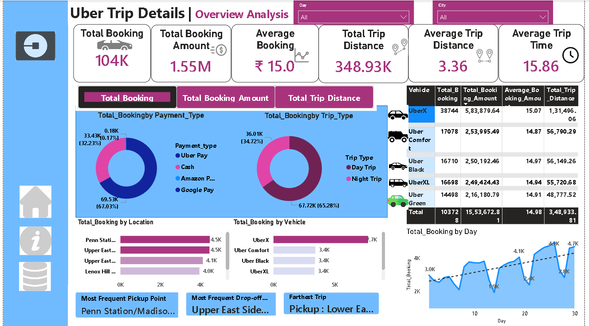
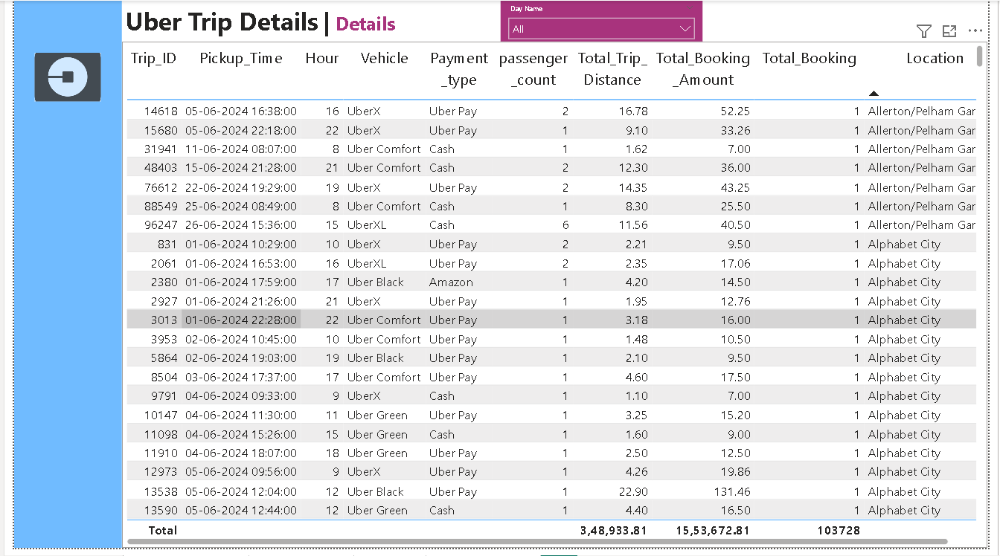
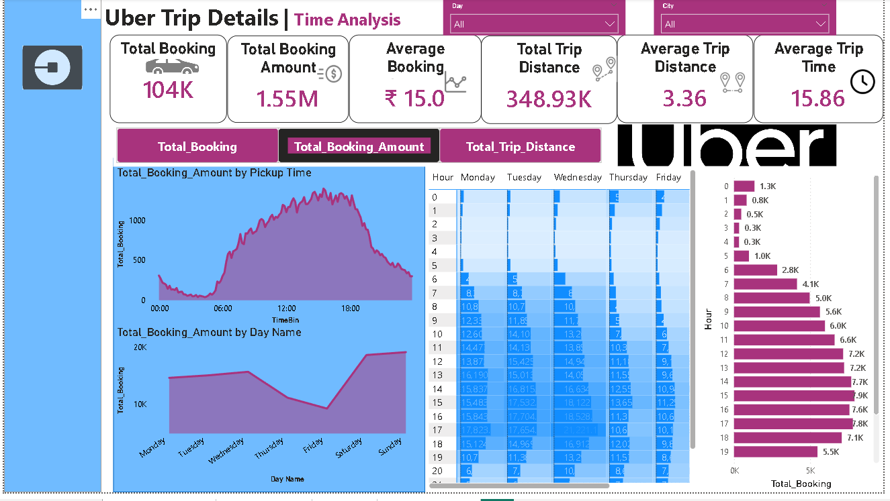
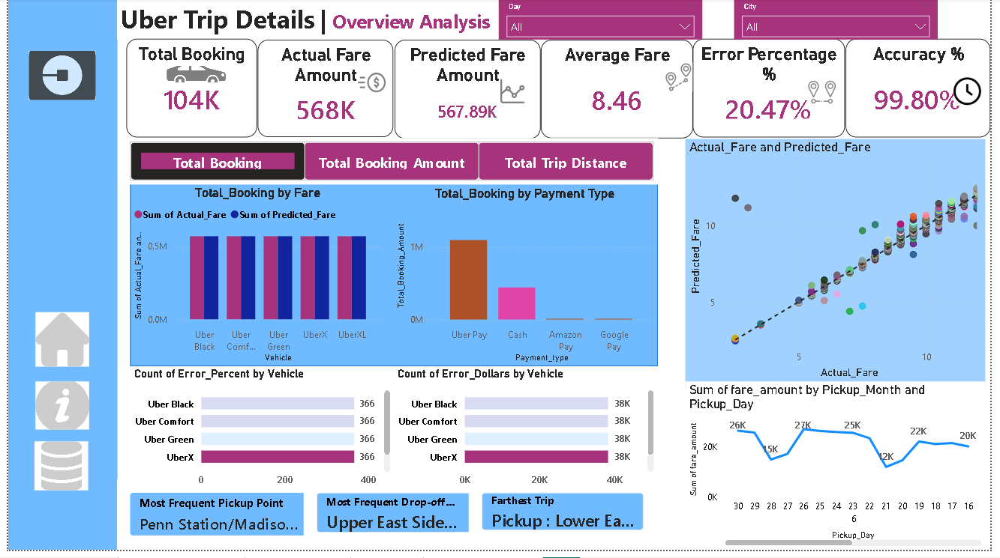

<<<<<<< HEAD
# 🚖 Uber Trip Analysis & Fare Prediction (ML + Microsoft Fabric + Power BI)

## 📌 Project Overview

This project demonstrates an **end‑to‑end Data Analytics and Machine
Learning pipeline** that analyzes Uber trip data and predicts trip fares
using machine learning.\
The workflow integrates **Python, Machine Learning, Microsoft Fabric
Lakehouse, Semantic Modeling, and Power BI dashboards** to transform raw
transportation data into business‑ready insights.

The goal of the project is to: - Analyze Uber trip patterns - Predict
trip fares using ML models - Build an interactive BI dashboard for
operational insights - Demonstrate a modern **data platform architecture
using Microsoft Fabric**

------------------------------------------------------------------------

# 🧠 Business Problem

Ride‑hailing platforms generate massive trip data every day.\
Understanding booking patterns, revenue drivers, and pricing behavior
can help companies:

-   Improve pricing strategies
-   Predict trip fares accurately
-   Optimize vehicle allocation
-   Analyze customer payment behavior
-   Identify high‑demand pickup zones

This project simulates a **data analytics workflow used in
transportation companies**.

------------------------------------------------------------------------

# 🏗️ End‑to‑End Architecture

Raw Uber Trip Data\
↓\
Data Cleaning & Feature Engineering (Python)\
↓\
Machine Learning Model Training (XGBoost)\
↓\
Fare Prediction Generation\
↓\
Upload Processed Data to Microsoft Fabric (Data Gen2)\
↓\
Store Data in Fabric Lakehouse\
↓\
Create Semantic Model\
↓\
Connect Power BI to Semantic Model\
↓\
Interactive Dashboard & Business Insights

------------------------------------------------------------------------

# ⚙️ Technologies Used

## Programming & Data Science

-   Python
-   Pandas
-   NumPy
-   Scikit‑learn
-   XGBoost
-   Matplotlib / Seaborn

## Cloud & Data Platform

-   Microsoft Fabric
-   Dataflow Gen2
-   Lakehouse Architecture
-   Semantic Model

## Visualization

-   Power BI
-   DAX Measures
-   Interactive Dashboard Design

------------------------------------------------------------------------

# 📊 Dataset Description

The dataset contains Uber trip details including:

  Column                 Description
  ---------------------- ---------------------------------
  Trip_ID                Unique identifier for each trip
  Pickup_Time            Timestamp of trip pickup
  Vehicle                Type of Uber vehicle
  Payment_type           Payment method used
  passenger_count        Number of passengers
  Total_Trip_Distance    Distance traveled
  Total_Booking_Amount   Actual fare charged
  Location               Pickup location
  City                   Trip city

Additional engineered features include: - Trip duration - Pickup hour -
Day of week - Distance based metrics

------------------------------------------------------------------------

# 🧹 Data Preprocessing

Key preprocessing steps performed:

-   Handling missing values
-   Feature engineering
-   Encoding categorical variables
-   Removing data leakage columns
-   Creating trip time features
-   Data normalization where required

------------------------------------------------------------------------

# 🤖 Machine Learning Model

A **regression model** was developed to predict Uber trip fares.

### Model Used

**XGBoost Regressor**

### Why XGBoost?

-   High performance on tabular datasets
-   Handles non‑linear relationships
-   Robust to overfitting
-   Strong predictive accuracy

### Model Evaluation Metrics

-   MAE (Mean Absolute Error)
-   RMSE (Root Mean Square Error)
-   R² Score
-   Prediction Accuracy %

------------------------------------------------------------------------

# 📈 Power BI Dashboard

The Power BI dashboard provides a **comprehensive operational and
revenue analysis**.

## Dashboard Pages

### 1️⃣ Overview Analysis

Provides a high‑level view of the Uber trip ecosystem.

Key KPIs:

-   Total Bookings
-   Total Booking Amount
-   Average Fare
-   Total Trip Distance
-   Average Trip Distance
-   Average Trip Time

Key Insights Visuals:

-   Bookings by Payment Type
-   Bookings by Trip Type
-   Bookings by Location
-   Bookings by Vehicle
-   Daily booking trend

------------------------------------------------------------------------

### 2️⃣ Detailed Trip Analysis

Provides granular trip-level data for deeper analysis.

Includes:

-   Trip ID
-   Pickup Time
-   Vehicle Type
-   Payment Method
-   Passenger Count
-   Distance
-   Booking Amount
-   Pickup Location

Used for operational investigation and filtering.

------------------------------------------------------------------------

### 3️⃣ Time-Based Analysis

Analyzes trip behavior across time dimensions.

Visuals include:

-   Booking trend by pickup hour
-   Heatmap of bookings by weekday and hour
-   Revenue trend throughout the day
-   Booking distribution by hour

This helps identify **peak demand periods**.

------------------------------------------------------------------------

# 📊 Machine Learning Prediction Dashboard

A separate dashboard compares:

-   Actual Fare vs Predicted Fare
-   Model prediction accuracy
-   Error percentage analysis
-   Revenue comparison by vehicle type
-   Payment behavior insights

Key Metrics:

-   Total Booking: 104K
-   Actual Fare Revenue: \~568K
-   Predicted Fare Revenue: \~567K
-   Average Fare: 8.46
-   Model Accuracy: \~99.8%

------------------------------------------------------------------------

# ☁️ Microsoft Fabric Implementation

The project demonstrates a modern cloud analytics pipeline.

### Step 1 -- Data Upload

The processed dataset with predictions was uploaded to **Fabric using
Dataflow Gen2**.

### Step 2 -- Lakehouse Storage

Data was stored inside a **Fabric Lakehouse** to enable scalable
analytics.

### Step 3 -- Semantic Model Creation

A **semantic model** was created to structure data for BI consumption.

### Step 4 -- Power BI Integration

Power BI was connected directly to the **Fabric semantic model**,
enabling cloud‑based reporting without local data dependencies.

------------------------------------------------------------------------

# 📂 Project Structure

    Uber-Trip-Analysis-and-Prediction
    │
    ├── notebooks
    │   └── experiment.ipynb
    │
    ├── data
    │   └── final_predictions_for_powerbi.csv
    │
    ├── powerbi
    │   └── uber_dashboard.pbix
    │
    ├── images
    │   └── dashboard_screenshots
    │
    └── README.md

------------------------------------------------------------------------

# 💼 Resume Project Highlights

✔ Built an end‑to‑end **Machine Learning prediction pipeline**\
✔ Implemented **XGBoost regression model for fare prediction**\
✔ Designed **interactive Power BI dashboards** with advanced KPIs\
✔ Integrated **Microsoft Fabric Lakehouse and Semantic Model**\
✔ Delivered business insights from **100K+ trip records**

------------------------------------------------------------------------

# 🚀 Future Improvements

Possible enhancements for the project:

-   Deploy ML model as an API
-   Automate data ingestion pipeline
-   Add real‑time streaming data
-   Implement demand forecasting
-   Build driver performance analytics

------------------------------------------------------------------------

# ⭐ Key Learnings

Through this project I gained hands‑on experience with:

-   Machine Learning workflows
-   Feature engineering for tabular data
-   Model evaluation and prediction analysis
-   Microsoft Fabric data architecture
-   Power BI dashboard design
-   End‑to‑end data analytics pipelines

------------------------------------------------------------------------

# 📬 Contact

If you found this project interesting or have suggestions, feel free to
connect.

**Author:** Karan Singh\
GitHub: https://github.com/codewithkaran-21

------------------------------------------------------------------------
=======
# Uber Trip Analysis and Prediction

## Introduction
This project analyzes Uber trip data to identify patterns and make predictions about future trips.

## Data Sources
- Uber Trip Data

## Analysis Results
The analysis revealed the following insights:
1. Peak trip times
2. Most popular destinations

## Conclusion
The project provides valuable insights for improving Uber services.

>>>>>>> 43ff5eaaed0c77c9bc781e05af66d76bf5c501d9
